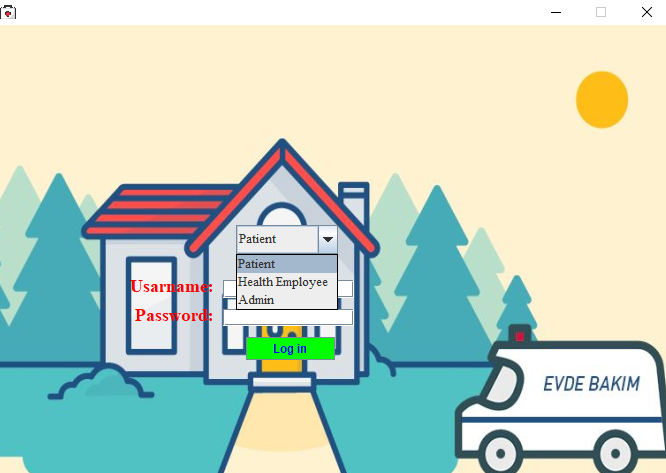
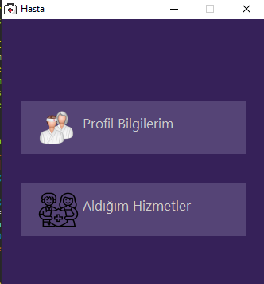
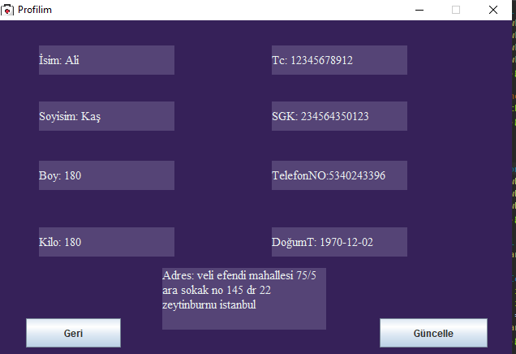
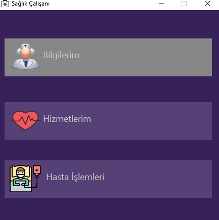
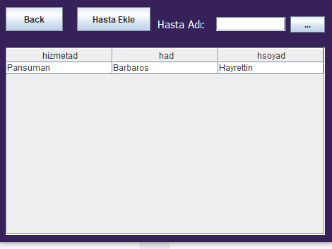
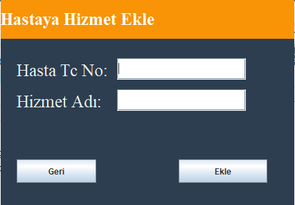
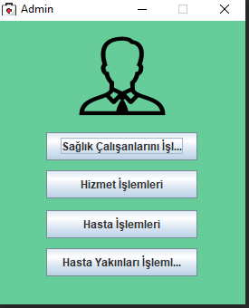
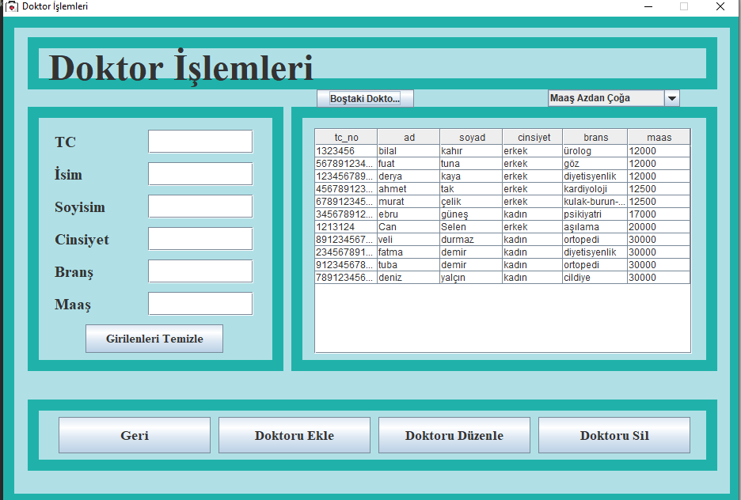

# Doctor-Patient-System
 We design 3 different interface for doctor,patient and manager
 
 
- Login-page 
 
 
# Patitent-side  
- Patients interface  
  

- Profil Bilgeleri
> Patient can see and uptade their information in Profil Bilgileri.Günccelle button is used to uptade information
  

- Aldığım Hizmetler
> It display services the patient receive
# Doktor-side
- InterFace
 

- Hizmetlerim
> Doctors see services they service
- Hasta islemlerim
> Doctors see  patients they service .Hasta Ekle button is used to add new service for their patient
 

 

# Admin -side  
- InterFace  
 

- Saglık calisani button
> Manager can add ,delete doctor also change their attribute (salary,location etc)
 

# How do you use
- After import the project to  your  IDE , reoload the postgresql-42.2.18.jar ,rs2xml.jar to the project because the jars file's paths dont uptade themself
- Change the password with your sql-password in SqlConnect.java

